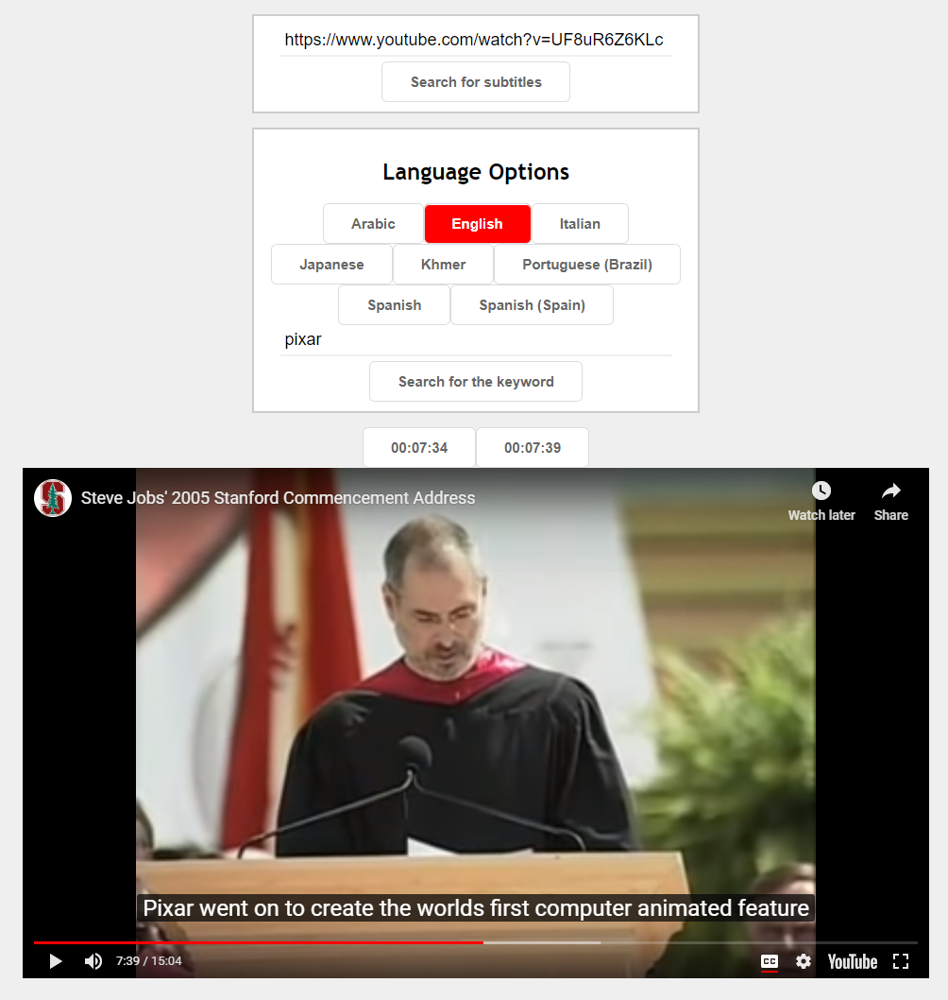
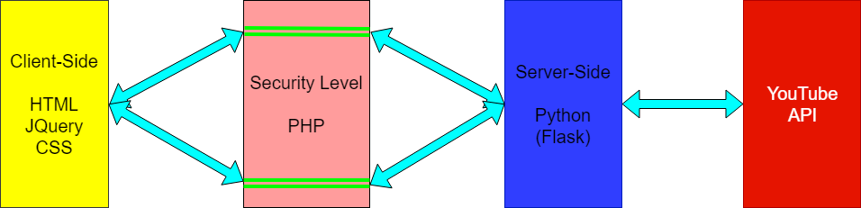

# Video Text Search - YouTube
Speed is the Key\
Online Preview: https://kounelisagis.me/video_text_search/

## Screenshot

## Inspiration
You want to watch a specific part of that long talk you have bookmarked. You want to find that specific time without much effort. This is what you are looking for!

## What it does
This web application searches for the keyword you want given a YouTube video with subtitles.

## Built With
- HTML, CSS, JQuery for the website
- Python(Flask) script running on server
- PHP as a security level between the user and the server

## Client-Side Part (HTML - JQuery)
The user enters a youtube link. JQuery code is responsible for keeping only the video id from the given url. Then using an Ajax a POST request is sent to the PHP server

## PHP Server Part
In essence this level does nothing. It only exist in order to hide the Python server url

## Server-Side Part (Python - Flask)
This server is responsible for:
- receiving a youtube video id and returning the subtitles language options
- receiving the language and the keyword selected by the user and returning the corresponding timestamps

## UML Diagram
The above procedure can be described with the following diagram:

